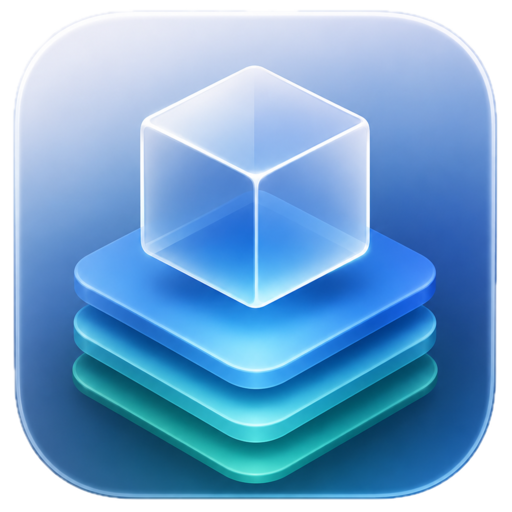

<p align="center">
  
</p>

# RunHaven


[](LICENSE)

Run Claude Code, Codex, Gemini, Antigravity, Copilot, or a custom AI agent
inside Apple `container` with beginner-safe local defaults.

This repo is for people who should not need to understand containers,
sandboxing, SSH agents, or credential leakage before using an AI coding agent on
their Mac. The default path mounts one project, gives the agent one isolated
home volume, avoids host secrets, and shows the exact container command before
anything runs.

[Quick start](#quick-start) |
[Supported agents](#supported-agents) |
[Security model](docs/SECURITY_MODEL.md) |
[Troubleshooting](#troubleshooting) |
[Development](#development) |
[Research](docs/RESEARCH.md)

## Status

Early foundation. RunHaven is usable for local testing and image builds. A
provider-egress smoke harness now proves the host allowlist proxy pattern, but
provider egress is not wired into normal agent runs yet.

Use `runhaven plan` before `runhaven run`. Treat internet-enabled runs as
unrestricted egress inside whatever Apple `container` and your host network
allow.

RunHaven only supports macOS 26+ on Apple silicon. Windows and Linux are not
supported runtimes or contributor verification targets for this project.

`--network provider` is reserved for provider egress allowlisting and still
fails closed for normal runs until the proved proxy pattern is integrated.

## What It Protects By Default

`runhaven` generates Apple `container` commands with these defaults:

- one selected project mounted at `/workspace`
- one per-project agent home volume mounted at the container agent home path
- no macOS home directory mount
- no raw SSH key mount
- no host cloud credential mount
- no arbitrary host environment passthrough
- read-only container root filesystem
- temporary container scratch directory
- dropped Linux capabilities
- non-root `agent` user in bundled images
- explicit command preview with `runhaven plan`

Useful opt-in controls:

- `--read-only-workspace` for review-only work
- `--network internal` for local-only commands
- `--network provider` to fail closed until reviewed provider allowlisting is
  implemented
- `--ssh` for SSH agent forwarding without mounting `~/.ssh`
- `--env NAME` for passing a single host environment variable by name
- `--tty never` for non-interactive automation
- `--allow-sensitive-workspace` only when you intentionally want to mount a
  broad or credential-bearing host path
- `--allow-root-user` only when you intentionally want the agent process to run
  as root inside the container

## What It Does Not Solve Yet

This is not a complete data-loss or exfiltration solution.

- Internet mode does not yet restrict outbound domains.
- The provider egress proxy has a live smoke harness, but it is not a normal
  `runhaven run` mode yet.
- The selected agent can still read files inside the mounted workspace and its
  isolated agent home volume.
- If a credential is available inside the agent home volume or passed with
  `--env NAME`, malicious repository content may try to misuse it.
- Agent-native approval systems are useful, but they are not a replacement for
  the outer container boundary.

See [Security model](docs/SECURITY_MODEL.md) and [Security policy](SECURITY.md)
for the full boundary.

## Requirements

- macOS 26+
- Apple silicon
- Python 3.13+
- Apple [`container`](https://github.com/apple/container) 1.0.0

The recommended Python runtime is 3.14.6. CI also tests Python 3.13.14 as the
minimum supported maintenance release.

RunHaven does not support Windows or Linux. Use a macOS 26+ Apple silicon host
for development, verification, image builds, and runtime checks.

This repo intentionally pins Apple `container` 1.0.0. If Apple ships a newer
runtime, `runhaven doctor` should fail until the repo updates and verifies the new
runtime pin.

## Quick Start

Install and start Apple `container` first:

```bash
container system start
```

Install this repo in a local virtual environment:

```bash
python3.14 -m venv .venv
source .venv/bin/activate
python -m pip install pip==26.1.2
python -m pip install --no-deps -e .
```

Check the Mac before running an agent:

```bash
runhaven doctor
```

Build and preview a bundled agent image:

```bash
runhaven image build claude
runhaven plan claude
```

Run the agent from the project directory you want it to work on:

```bash
runhaven run claude
```

## Plan Before Run

`runhaven plan` is the trust checkpoint. It prints the workspace, the isolated
state volume, preflight setup, network mode, and exact Apple `container run`
command.

Example shape:

```text
Workspace: selected project directory
State volume: runhaven-claude-...-home
Network: default internet network
Egress: unrestricted internet egress; domain allowlisting is not enforced
Preflight:
  container network create --internal runhaven-volume-prep-internal
  container run ... --no-dns --network runhaven-volume-prep-internal ...
Run:
  container run --rm --init --read-only --tmpfs <container-temp> --cap-drop ALL ...
```

If the plan shows a mount, environment variable, or network mode you do not
expect, stop before running it.

## Supported Agents

```bash
runhaven agents
```

Bundled profiles:

| Profile | Default image | Use case |
| --- | --- | --- |
| `claude` | `runhaven/claude:0.1.0` | Claude Code with isolated project state |
| `codex` | `runhaven/codex:0.1.0` | Codex CLI with its own workspace sandbox enabled |
| `gemini` | `runhaven/gemini:0.1.0` | Gemini CLI with project-scoped home state |
| `antigravity` | `runhaven/antigravity:0.1.0` | Antigravity CLI in the same container boundary |
| `copilot` | `runhaven/copilot:0.1.0` | GitHub Copilot CLI with isolated state |
| `shell` | `runhaven/base:0.1.0` | Generic shell profile for custom agent images |

Use `shell` for another agent image:

```bash
runhaven plan shell --image my-agent:2026.06.14 -- my-agent --help
```

## Common Workflows

Read-only review:

```bash
runhaven run codex --read-only-workspace
```

Private Git access without mounting raw SSH keys:

```bash
runhaven run claude --ssh
```

Local-only command:

```bash
runhaven run shell --network internal -- python -m unittest discover -s tests
```

Reserved provider-only mode:

```bash
runhaven plan claude --network provider
```

This exits with a clear error until RunHaven has a verified enforcement
mechanism wired into normal agent runs.

Pass a token by variable name only:

```bash
runhaven run codex --env OPENAI_API_KEY
```

`runhaven` rejects `NAME=value` so secrets do not get copied into shell history or
dry-run output.

List or remove isolated agent home volumes:

```bash
runhaven state list
runhaven state prune --yes
```

## Troubleshooting

Run this first:

```bash
runhaven doctor
```

If a run fails, collect these commands before opening an issue:

```bash
runhaven doctor
runhaven plan <agent>
container system status
```

Do not paste secret values, API keys, SSH keys, or private repository contents
into issues.

## Development

```bash
python3.14 -m venv .venv
source .venv/bin/activate
python -m pip install pip==26.1.2
python -m pip install -r requirements-dev.txt
python -m pip install --no-deps -e .
python -m compileall src tests scripts
PYTHONPATH=src python -m unittest discover -s tests
python scripts/check_pins.py
```

Full local harness verification:

```bash
./init.sh
```

Optional individual checks:

```bash
python -m ruff check .
python -m mypy src
python -m build
```

## Pinning Rule

All package, image, tool, and CI action dependencies must use the current stable
release and be hard-pinned. Do not commit floating version ranges, mutable
`latest` tags, major-only GitHub Action refs, unversioned installer scripts, or
unpinned package installs.

Current pins are recorded in [pins.toml](pins.toml). The source ledger is
[docs/RESEARCH.md](docs/RESEARCH.md).

## Documentation

- [Usage](docs/USAGE.md)
- [Architecture](docs/ARCHITECTURE.md)
- [Security model](docs/SECURITY_MODEL.md)
- [Pinning policy](docs/PINNING.md)
- [Research and source ledger](docs/RESEARCH.md)
- [Roadmap](docs/ROADMAP.md)
- [Contributing](CONTRIBUTING.md)
- [Security policy](SECURITY.md)

## License

[MIT](LICENSE)
